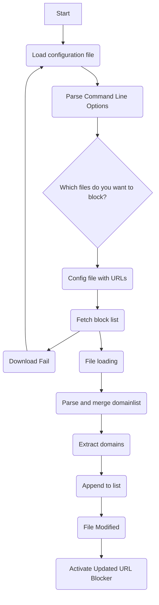

```mermaid
flowchart TD
    Start --> Initialise("Load configuration file")
    Initialise --> Parse-command-line-options("Parse Command Line Options")
    Parse-command-line-options --> Getfileoptions{"Which files do you want to block?"}
    Getfileoptions --> ReadConfigFile("Config file with URLs")
    ReadConfigFile --> Download-blocklist("Fetch block list")
    Download-blocklist --> Download-fail("Download Fail")
    Download-blocklist --> Correct-file("File loading")
    Download-fail --> Initialise
    Correct-file --> Parse-merge-domainlist("Parse and merge domainlist")
    Parse-merge-domainlist --> Regex("Extract domains")
    Regex --> CombineList("Append to list")
    CombineList --> ModifiedHostFile("File Modified")
    ModifiedHostFile --> End("Activate Updated URL Blocker") 
```
