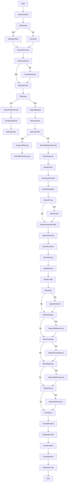

```mermaid
flowchart TD
    Start --> GetHostsPath
    GetHostsPath --> IsWindows
    IsWindows --> |Yes| WindowsPath
    IsWindows --> |No| UnixPath
    WindowsPath --> EnsureDirectory
    UnixPath --> EnsureDirectory
    EnsureDirectory --> DirectoryExists
    DirectoryExists --> |No| CreateDirectory
    DirectoryExists --> |Yes| BackupHosts
    CreateDirectory --> BackupHosts
    BackupHosts --> FileExists
    FileExists --> |Yes| CopyToBackup
    FileExists --> |No| ShowFileNotFound
    ShowFileNotFound --> CreateEmptyFile
    CreateEmptyFile --> RetryBackup
    CopyToBackup --> RestoreHosts
    RestoreHosts --> BackupExists
    BackupExists --> |Yes| CopyLastBackup
    BackupExists --> |No| ShowNoBackupFound
    CopyLastBackup --> ShowRestoreSuccess
    ShowNoBackupFound --> DownloadLists
    DownloadLists --> IterateURLs
    IterateURLs --> DownloadContent
    DownloadContent --> ShowDebugInfo
    ShowDebugInfo --> CheckIPLine
    CheckIPLine --> |Yes| AddDomain
    CheckIPLine --> |No| ShowDownloadFailed
    AddDomain --> ShowDownloadFailed
    ShowDownloadFailed --> AppendToHosts
    AppendToHosts --> IterateDomains
    IterateDomains --> WriteToHosts
    WriteToHosts --> UpdateHosts
    UpdateHosts --> ReadConfig
    ReadConfig --> BlockAds
    BlockAds --> |Yes| AppendAdLists
    BlockAds --> |No| BlockMalware
    AppendAdLists --> BlockMalware
    BlockMalware --> |Yes| AppendMalwareLists
    BlockMalware --> |No| BlockTracking
    AppendMalwareLists --> BlockTracking
    BlockTracking --> |Yes| AppendTrackingLists
    BlockTracking --> |No| BlockMalicious
    AppendTrackingLists --> BlockMalicious
    BlockMalicious --> |Yes| AppendMaliciousLists
    BlockMalicious --> |No| NoBlockLists
    AppendMaliciousLists --> NoBlockLists
    NoBlockLists --> |Yes| ShowNoBlockLists
    NoBlockLists --> |No| CreateGUI
    ShowNoBlockLists --> CreateGUI
    CreateGUI --> CreateWindow
    CreateWindow --> SetWindowTitle
    SetWindowTitle --> CreateLabels
    CreateLabels --> CreateButtons
    CreateButtons --> StartMainLoop
    StartMainLoop --> End
```
```
