# Executive Summary

This report details the development of a host-based domain checker aimed at enhancing the management and monitoring of domain assets across various hosting platforms. The project leverages automation and advanced querying techniques to meet the needs of administrators and stakeholders in domain infrastructure oversight.

# Project Overview

## Introduction

This project introduces a comprehensive host-based domain checker, designed to streamline the management and monitoring of domain assets across diverse hosting platforms. By harnessing automation and leveraging advanced querying techniques, this tool aims to address the evolving needs of administrators and stakeholders tasked with overseeing domain infrastructures.

## Team Structure and Roles

Our team was organized to maximize efficiency and ensure clear role distribution. The roles and responsibilities were as follows:

- **Jarna Salonen (13229846)**: Project Manager. Responsible for project oversight, code development, and testing.
- **Shehreen Haider (13247624)**: Lead Developer. Responsible for project oversight, code development, and testing.
- **Nick Woolcock**(): Documentation Specialist and Tester. Responsible for creating project documentation and conducting rigorous testing.

## Problem Analysis and Requirements

We analyzed the need for a domain checker that automates the process of managing domain assets. The requirements for the solution included:

The ability to accept user-defined options for blocking specific content types (advertisements, malware, tracking).
Reading URLs of domain block-lists from a configuration file.
Downloading, parsing, and merging hosts files into a unique list of domains.
Backing up the original hosts file with the option to restore it.
Appending blocked domains to the existing hosts file without replacing it.
Ensuring cross-platform compatibility for Windows and Linux.

# Design Process

## Conceptual Design

The initial concept focused on a user-friendly tool that automates domain management tasks. Key considerations included ease of use, reliability, and extensibility.

## Algorithm Design

Our algorithm parses and updates the hosts file based on user preferences. Below is a flowchart representing the algorithm.

```mermaid
flowchart TD
    Start --> GetHostsPath
    GetHostsPath --> IsWindows
    IsWindows --> |Yes| WindowsPath
    IsWindows --> |No| UnixPath
    WindowsPath --> EnsureDirectory
    UnixPath --> EnsureDirectory
    EnsureDirectory --> DirectoryExists
    DirectoryExists --> |No| CreateDirectory
    DirectoryExists --> |Yes| BackupHosts
    CreateDirectory --> BackupHosts
    BackupHosts --> FileExists
    FileExists --> |Yes| CopyToBackup
    FileExists --> |No| ShowFileNotFound
    ShowFileNotFound --> CreateEmptyFile
    CreateEmptyFile --> RetryBackup
    CopyToBackup --> RestoreHosts
    RestoreHosts --> BackupExists
    BackupExists --> |Yes| CopyLastBackup
    BackupExists --> |No| ShowNoBackupFound
    CopyLastBackup --> ShowRestoreSuccess
    ShowNoBackupFound --> DownloadLists
    DownloadLists --> IterateURLs
    IterateURLs --> DownloadContent
    DownloadContent --> ShowDebugInfo
    ShowDebugInfo --> CheckIPLine
    CheckIPLine --> |Yes| AddDomain
    CheckIPLine --> |No| ShowDownloadFailed
    AddDomain --> ShowDownloadFailed
    ShowDownloadFailed --> AppendToHosts
    AppendToHosts --> IterateDomains
    IterateDomains --> WriteToHosts
    WriteToHosts --> UpdateHosts
    UpdateHosts --> ReadConfig
    ReadConfig --> BlockAds
    BlockAds --> |Yes| AppendAdLists
    BlockAds --> |No| BlockMalware
    AppendAdLists --> BlockMalware
    BlockMalware --> |Yes| AppendMalwareLists
    BlockMalware --> |No| BlockTracking
    AppendMalwareLists --> BlockTracking
    BlockTracking --> |Yes| AppendTrackingLists
    BlockTracking --> |No| BlockMalicious
    AppendTrackingLists --> BlockMalicious
    BlockMalicious --> |Yes| AppendMaliciousLists
    BlockMalicious --> |No| NoBlockLists
    AppendMaliciousLists --> NoBlockLists
    NoBlockLists --> |Yes| ShowNoBlockLists
    NoBlockLists --> |No| CreateGUI
    ShowNoBlockLists --> CreateGUI
    CreateGUI --> CreateWindow
    CreateWindow --> SetWindowTitle
    SetWindowTitle --> CreateLabels
    CreateLabels --> CreateButtons
    CreateButtons --> StartMainLoop
    StartMainLoop --> End
```



## Pseudo Code

```
BEGIN

DEFINE CONSTANT CONFIG_FILE = 'config.json'

FUNCTION get_hosts_file_path():
    IF system is 'Windows':
        RETURN 'C:\blocked_hosts\hosts'
    ELSE:
        RETURN '/etc/blocked_hosts/hosts'

FUNCTION ensure_directory_exists(path):
    directory = get the directory name from path
    IF directory does not exist:
        create the directory

FUNCTION backup_hosts_file(hosts_path):
    timestamp = current timestamp formatted as 'YYYYMMDDHHMMSS'
    backup_path = hosts_path + '_backup_' + timestamp
    TRY:
        copy hosts_path to backup_path
        copy hosts_path to 'hosts_last_used'
        RETURN backup_path
    CATCH FileNotFoundError:
        SHOW error message "Hosts file not found at hosts_path. Creating a new one."
        ensure_directory_exists(hosts_path)
        create an empty file at hosts_path
        CALL backup_hosts_file(hosts_path)
    CATCH PermissionError:
        SHOW error message "Permission denied: Unable to access hosts_path. Please run the script as an administrator."
        RAISE the error

FUNCTION restore_hosts_file():
    hosts_path = CALL get_hosts_file_path()
    IF 'hosts_last_used' exists:
        copy 'hosts_last_used' to hosts_path
        SHOW info message "Hosts file restored to the last used state."
    ELSE:
        SHOW error message "No backup found to restore."

FUNCTION download_and_parse_lists(urls):
    domains = an empty set
    FOR each url in urls:
        TRY:
            PRINT "Downloading from url..."
            response = download content from url
            response.raise_for_status()
            PRINT first 500 characters of response content for debugging
            FOR each line in response content:
                trim whitespace from line
                IF line starts with '0.0.0.0' OR '127.0.0.1':
                    split line into parts
                    IF parts length > 1:
                        domain = second part of parts
                        add domain to domains set
        CATCH RequestException as e:
            PRINT "Failed to download url: e"
    PRINT "Collected domains: domains"
    RETURN domains

FUNCTION append_to_hosts_file(hosts_path, domains):
    OPEN hosts_path in append mode as hosts_file:
        FOR each domain in domains:
            WRITE "0.0.0.0 domain" to hosts_file
    PRINT "Appended domains to hosts file: domains"

FUNCTION update_hosts_file(block_ads, block_malware, block_tracking, block_malicious):
    OPEN CONFIG_FILE in read mode as file:
        config = parse JSON from file

    urls = an empty list
    IF block_ads:
        append 'ad_block_lists' from config to urls
    IF block_malware:
        append 'malware_block_lists' from config to urls
    IF block_tracking:
        append 'tracking_block_lists' from config to urls
    IF block_malicious:
        append 'ad_block_lists' from config to urls

    IF urls is empty:
        SHOW error message "No block lists selected."
        RETURN

    domains = CALL download_and_parse_lists(urls)
    hosts_path = CALL get_hosts_file_path()
    TRY:
        CALL backup_hosts_file(hosts_path)
        CALL append_to_hosts_file(hosts_path, domains)
        SHOW info message "Hosts file updated successfully."
    CATCH PermissionError:
        RETURN

FUNCTION create_gui():
    root = CREATE a new Tkinter window
    SET title of root to "Hosts-Based Domain Blocker"

    CREATE and pack a label "Select the types of content to block:"

    DEFINE BooleanVar block_ads, block_malware, block_tracking, block_malicious

    CREATE and pack checkbuttons for each BooleanVar with corresponding labels

    CREATE and pack a button "Update Hosts File" with command to CALL update_hosts_file with BooleanVars values
    CREATE and pack a button "Restore Hosts File" with command to CALL restore_hosts_file

    START the Tkinter main loop

IF script is run as main:
    CALL create_gui()

END
```

## Software Design

The software is designed in Python due to its simplicity and extensive library support. The architecture includes modules for configuration management, URL fetching, file manipulation, and user interaction through a GUI.

# Implementation

## Code Development

The code developed for this project includes functions for downloading and parsing domain lists, backing up and updating the hosts file, and a GUI for user interaction. The main script integrates these components.

```python
import os
import platform
import shutil
import requests
import re
import json
import tkinter as tk
from tkinter import messagebox
from datetime import datetime

CONFIG_FILE = 'config.json'

def get_hosts_file_path():
    return r'D:\test\hosts' if platform.system() == 'Windows' else '/etc/hosts'

def backup_hosts_file(hosts_path):
    timestamp = datetime.now().strftime('%Y%m%d%H%M%S')
    backup_path = f"{hosts_path}_backup_{timestamp}"
    shutil.copy2(hosts_path, backup_path)
    shutil.copy2(hosts_path, 'hosts_last_used')
    return backup_path

def restore_hosts_file():
    hosts_path = get_hosts_file_path()
    if os.path.exists('hosts_last_used'):
        shutil.copy2('hosts_last_used', hosts_path)
        messagebox.showinfo("Restore", "Hosts file restored to the last used state.")
    else:
        messagebox.showerror("Restore", "No backup found to restore.")

def download_and_parse_lists(urls):
    domains = set()
    for url in urls:
        try:
            response = requests.get(url)
            response.raise_for_status()
            # Debug print to check the content of the response
            print(f"Content from {url}:\n{response.text[:500]}...\n")  # Print first 500 characters
            domains.update(re.findall(r'^\s*(?:0\.0\.0\.0|127\.0\.0\.1)\s+(\S+)', response.text, re.MULTILINE))
        except requests.RequestException as e:
            print(f"Failed to download {url}: {e}")
    return domains


def append_to_hosts_file(hosts_path, domains):
    with open(hosts_path, 'a') as hosts_file:
        hosts_file.write('\n'.join(f"0.0.0.0 {domain}" for domain in domains) + '\n')

def update_hosts_file(block_ads, block_malware, block_tracking, block_malicious):
    with open(CONFIG_FILE, 'r') as file:
        config = json.load(file)

    urls = []
    if block_ads:
        urls.extend(config.get('ad_block_lists', []))
    if block_malware:
        urls.extend(config.get('malware_block_lists', []))
    if block_tracking:
        urls.extend(config.get('tracking_block_lists', []))
    if block_malicious:
        urls.extend(config.get('malicious_block_lists', []))

    if not urls:
        messagebox.showerror("Error", "No block lists selected.")
        return

    domains = download_and_parse_lists(urls)
    hosts_path = get_hosts_file_path()
    backup_hosts_file(hosts_path)
    append_to_hosts_file(hosts_path, domains)
    messagebox.showinfo("Success", "Hosts file updated successfully.")

def create_gui():
    root = tk.Tk()
    root.title("Hosts-Based Domain Blocker")

    tk.Label(root, text="Select the types of content to block:").pack(pady=10)

    block_ads = tk.BooleanVar()
    block_malware = tk.BooleanVar()
    block_tracking = tk.BooleanVar()
    block_malicious = tk.BooleanVar()

    tk.Checkbutton(root, text="Advertisements", variable=block_ads).pack(anchor='w')
    tk.Checkbutton(root, text="Malware", variable=block_malware).pack(anchor='w')
    tk.Checkbutton(root, text="Tracking", variable=block_tracking).pack(anchor='w')
    tk.Checkbutton(root, text="Malicious", variable=block_malicious).pack(anchor='w')

    tk.Button(root, text="Update Hosts File", command=lambda: update_hosts_file(block_ads.get(), block_malware.get(), block_tracking.get(), block_malicious)).pack(pady=10)
    tk.Button(root, text="Restore Hosts File", command=restore_hosts_file).pack(pady=10)

    root.mainloop()

if __name__ == '__main__':
    create_gui()
## Testing and Debugging
```

## Testing and Debugging

Testing involved verifying the program's ability to download block lists, parse domain entries, back up the hosts file, and update it without issues. We used a combination of unit tests and manual testing to ensure robustness.

# Collaboration and Project Management

## Meeting Notes

Regular team meetings were held to discuss progress, address challenges, and plan upcoming tasks. Decisions and action items were documented for reference.

## Project Management Tools and Techniques

We used tools such as Trello for task management, GitHub for version control, and Slack for communication. Agile methodologies were employed to maintain flexibility and ensure timely delivery of project milestones.

# Documentation

## Developer Documentation

The developer documentation includes detailed explanations of the code structure, functions, and modules. This ensures future developers can easily understand and maintain the project.

## User Documentation

A separate user manual has been created to guide end-users on how to install, configure, and use the domain blocker tool. This document is available in the project repository.

# Reflection and Conclusion

The project presented several challenges, including ensuring cross-platform compatibility and handling various edge cases during domain list parsing. These challenges were overcome through thorough testing and iterative development. The project successfully met its objectives, providing a reliable tool for managing domain block lists. Future improvements could include adding a GUI for configuring block lists and enhancing performance for large domain lists.

# Appendices

Links to the code repositories containing the final source code, user manuals, presentations, and other documentation:

[GitHub Repository]
